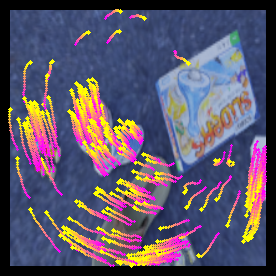
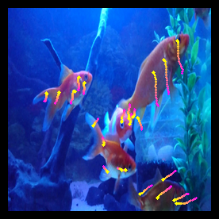

# [NeurIPS 2023] <center>Continuous Parametric Optical Flow</center>
<div align='center'> 
Jianqin Luo*, Zhexiong Wan*, Yuxin Mao, Bo Li, Yuchao Dai† 
</div>
<div align='center'> 
Northwestern Polytechnical University, Xi’an, China
</div>
<div align='center'> 
Shaanxi Key Laboratory of Information Acquisition and Processing
</div>
<div align='center'> 
<a href="https://openreview.net/pdf?id=ZZgfS1DbmO" target="_blank">Paper</a> &nbsp
  <a href="https://npucvr.github.io/CPFlow" target="_blank">Project</a>
</div>

## Abstract
In this paper, we present *continuous parametric optical flow*, a parametric representation of **dense and continuous motion over arbitrary time interval**. In contrast
to existing discrete-time representations (i.e.flow in between consecutive frames),
this new representation transforms the frame-to-frame pixel correspondences to
dense continuous flow. In particular, we present a temporal-parametric model that
employs B-splines to fit point trajectories using a limited number of frames. To
further improve the stability and robustness of the trajectories, we also add an
encoder with a neural ordinary differential equation (ODE) to represent features
associated with specific times. We also contribute a synthetic dataset and introduce
two evaluation perspectives to measure the accuracy and robustness of continuous
flow estimation. Benefiting from the combination of explicit parametric modeling
and implicit feature optimization, our model focuses on motion continuity and
outperforms than the flow-based and point-tracking approaches for fitting long-term
and variable sequences.
<table>
    <tr>
        <td ><center></center></td>
        <td ><center></center></td>
        <td ><center></center></td>
        <td ><center> </center></td>
    </tr>
</table>

## Requirements
Python 3.8.10 with basic conda environment. Install the requirements as follow:
```python
pip install -r requirements.txt
```

## Evaluation
1. Dataset Preparation
* Download the [TAP-Vid-DAVIS](https://storage.googleapis.com/dm-tapnet/tapvid_davis.zip). 
Put the single ```*.pkl``` file into folder ```./datasets/tap_vid_davis ```
* Refer to the instruction to generate [TAP-Vid-Kinetics](https://github.com/google-deepmind/tapnet/tree/main/data).Put all  ```*.pkl``` files into folder ```./datasets/tap_vid_kinetics ```
* Note: please use the *dataset_mode* to decide which one to evaluate (*davis* for Vid-TAP-DAVIS & *kinetics* for Vid-TAP-Kinetics) 

2. Metric Selection
* Accuracy(ade_all) & Smoothness(TRMSE) analysis using the *ade_rmse*
* visibility(ade_vis) & occlusion(ade_occ) analysis
using the *ade_occ*

3. Inference
- *Example: analyse the overall trajectory quality(accuracy & smoothness) on TAP-Vid-DAVIS*
```python
python eval_real_scene.py --dataset_mode davis --method ade_rmse
```

4. Download the [weight](https://pan.baidu.com/s/18U5F6PgS0eOJXV1A-x_QLw?pwd=hudd) ```cp_flow_30.pth``` and put it into folder ```./checkpoints```

## Training
We recommend parallel training with multiple GPUs. The ```dataset_dir``` and ```save_path``` denote the path where the training dataset is stored and the directory where the model weights are saved, respectively. A training sample is below:

- *Example: use a single machine with 4 GPUs for training* 
```python
CUDA_VISIBLE_DEVICES=0,1,2,3 python -m torch.distributed.launch --nproc_per_node=4 --nnodes=1 --node_rank=0 --master_addr="YOUR_IP" --master_port="YOUR_PORT"  kubric_sparse_train_all.py --dataset_dir "YOUR_DATASET_PATH" --save_path "YOUR_SAVE_PATH"
```
We also provide the sampler code for variable-length training. Please refer to ```kubric_dataset.py```.

Due to the large-scale transferring, we will upload the whole training dataset simulated by [kubric](https://github.com/google-research/kubric) later. 

## Acknowledgement
Thanks for the inspiration from the following work:
* [Vid-ODE: Continuous-Time Video Generation with Neural Ordinary Differential Equation](https://arxiv.org/abs/2010.08188)
* [Raft: Recurrent all-pairs field transforms for optical flow](https://arxiv.org/pdf/2003.12039)
* [Tap-vid: A benchmark for tracking any point in a video](https://proceedings.neurips.cc/paper_files/paper/2022/file/58168e8a92994655d6da3939e7cc0918-Paper-Datasets_and_Benchmarks.pdf)


